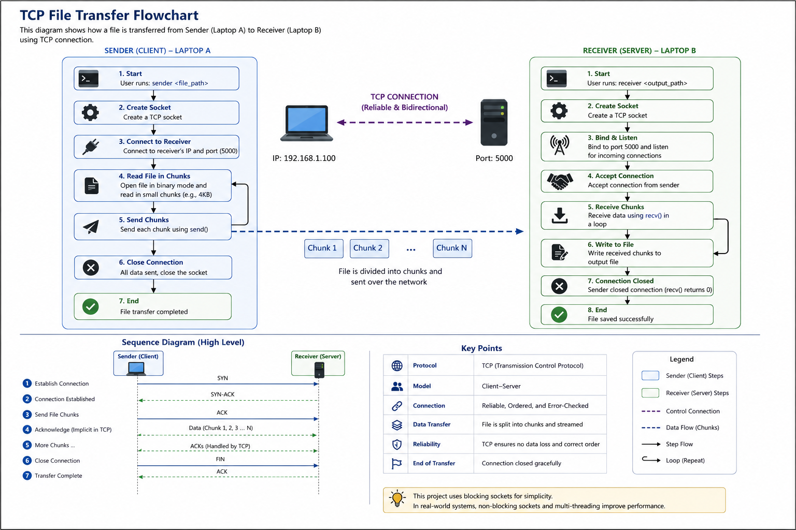

# 🚀 Decentralized LAN File Sharing

A C++ based peer-to-peer file transfer system that enables direct file sharing between devices over a local network using TCP sockets.

---

## 📌 Overview

This project implements a **decentralized file sharing system** where two devices communicate directly over a LAN without any central server.

It demonstrates:

* Low-level **socket programming**
* **TCP-based reliable data transfer**
* **Chunked file streaming**
* Real-world networking concepts

---

## 🏗️ Project Structure

```
decentralized-lan-file-sharing/
├── src/
│   ├── sender.cpp       ← Run on sender machine
│   └── receiver.cpp     ← Run on receiver machine
├── include/
├── build/
├── CMakeLists.txt
└── README.md
```

---

## ⚙️ Building the Project

### 🔧 Prerequisites

* C++17 compatible compiler (MinGW / GCC / Clang)
* CMake 3.10+
* Windows / Linux / macOS

---

### 🛠️ Build Steps

```bash
mkdir build
cd build
cmake ..
cmake --build .
```

---

## ▶️ Usage

### 🖥️ Step 1: Start Receiver (Server)

```bash
build\receiver.exe output.txt
```

Output:

```
[*] Receiver listening on port 5000 ...
```

---

### 💻 Step 2: Run Sender (Client)

```bash
build\sender.exe <receiver_ip> testfile.txt
```

Example:

```bash
build\sender.exe 127.0.0.1 testfile.txt
```

---

## 🧪 Example Output

### Receiver:

```
[*] Receiver listening on port 5000 ...
[+] Connected from: 127.0.0.1
[+] Received: 28 bytes
[+] Sender disconnected normally.
[+] File saved to: output.txt
```

### Sender:

```
[*] Connecting to 127.0.0.1:5000 ...
[+] Connected to receiver.
[*] Sending file: testfile.txt
[+] Progress: 100%
[+] File sent successfully!
```

---

## 🔄 How It Works (TCP Flow)

1. Receiver starts and listens on port **5000**
2. Sender connects using receiver's IP address
3. File is opened in binary mode
4. File is split into **chunks (4KB buffer)**
5. Sender sends chunks using `send()`
6. Receiver receives chunks using `recv()`
7. Data is written to output file
8. Connection closes after transfer completes

---

## 🌐 TCP Explained (Beginner Friendly)

This project uses **TCP (Transmission Control Protocol)** which ensures:

* ✅ Reliable delivery (no data loss)
* ✅ Ordered data (correct sequence)
* ✅ Automatic retransmission of lost packets

Unlike UDP, TCP guarantees that the file received is **exactly identical** to the original file.

---

## 📊 Architecture

* **Model**: Client-Server
* **Protocol**: TCP/IP
* **Port**: 5000
* **Transfer Type**: Chunk-based streaming
* **I/O Model**: Blocking sockets

---

## 🔑 Key Concepts Used

* Socket Programming (`socket`, `bind`, `listen`, `accept`, `connect`)
* File Handling (binary read/write)
* Buffer-based data transfer
* Network communication over LAN

---

## ⚠️ Notes

* Works on same machine (`127.0.0.1`) and LAN networks
* No encryption/authentication (basic version)
* Firewall may block connections (allow port 5000)

---

## 🖼️ Flow Diagram



> Shows how sender and receiver communicate using TCP connection and chunk-based transfer.

---

## 🚀 Future Enhancements

* [ ] UDP-based peer discovery (AirDrop-like)
* [ ] End-to-end encryption (AES)
* [ ] Resume interrupted transfers
* [ ] GUI interface
* [ ] Multi-peer file sharing
* [ ] Cross-platform optimization

---

## 🏆 Resume Highlight

> Built a decentralized LAN-based file sharing system using C++ and TCP sockets, enabling reliable chunk-based file transfer between devices without a central server.

---

## 📌 Conclusion

This project demonstrates fundamental concepts of:

* Computer Networks
* Distributed Systems
* System Programming

It serves as a strong foundation for building advanced systems like:

* Torrent clients
* Cloud storage systems
* Peer-to-peer networks

---
>>>>>>> 71fbcec (feat: Phase 1 - working TCP file transfer (sender + receiver))
